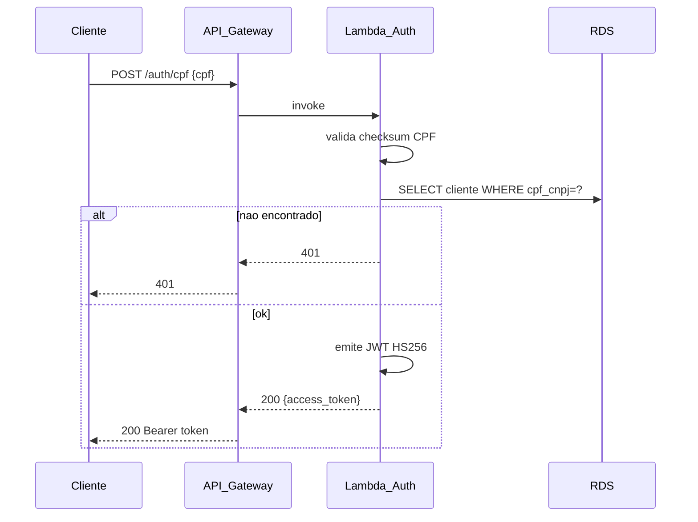
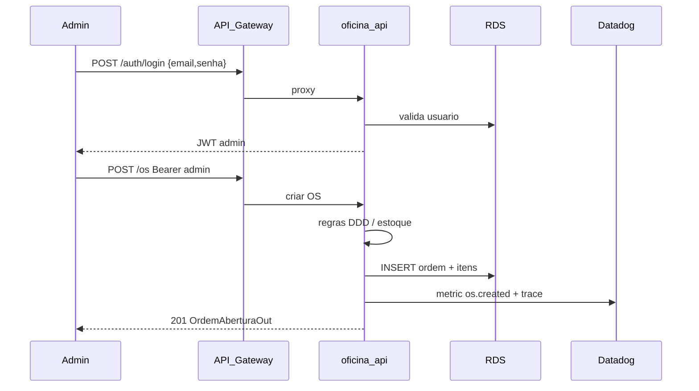
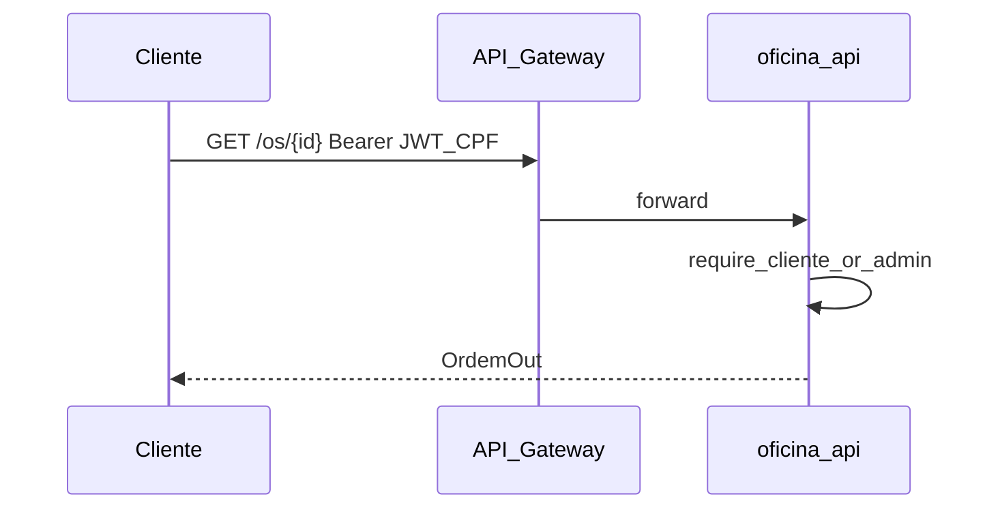

# Diagrama de Sequência — Autenticação CPF e abertura de OS

## 1. Autenticação por CPF

```mermaid
sequenceDiagram
  participant C as Cliente
  participant GW as API_Gateway
  participant L as Lambda_Auth
  participant DB as RDS

  C->>GW: POST /auth/cpf {cpf}
  GW->>L: invoke
  L->>L: valida checksum CPF
  L->>DB: SELECT cliente WHERE cpf_cnpj=?
  alt nao encontrado
    L-->>GW: 401
    GW-->>C: 401
  else ok
    L->>L: emite JWT HS256
    L-->>GW: 200 {access_token}
    GW-->>C: 200 Bearer token
  end
```

## 2. Abertura de ordem de serviço (admin)

```mermaid
sequenceDiagram
  participant A as Admin
  participant GW as API_Gateway
  participant API as oficina_api
  participant DB as RDS
  participant DD as Datadog

  A->>GW: POST /auth/login {email,senha}
  GW->>API: proxy
  API->>DB: valida usuario
  API-->>A: JWT admin

  A->>GW: POST /os Bearer admin
  GW->>API: criar OS
  API->>API: regras DDD / estoque
  API->>DB: INSERT ordem + itens
  API->>DD: metric os.created + trace
  API-->>A: 201 OrdemAberturaOut
```

## 3. Consulta de OS pelo cliente autenticado

```mermaid
sequenceDiagram
  participant C as Cliente
  participant GW as API_Gateway
  participant API as oficina_api

  C->>GW: GET /os/{id} Bearer JWT_CPF
  GW->>API: forward
  API->>API: require_cliente_or_admin
  API-->>C: OrdemOut
```
